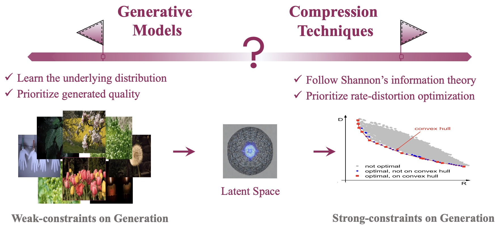

# Awesome_ELIC
Paper list of Extreme Learned Image Compression (ELIC) for human vision and machine vision.

**Maintained by:** [Lingyu Zhu](https://scholar.google.com/citations?user=IhyTEDkAAAAJ&hl=zh-CN)

# Overview

# Notes
- If you find papers relevant to this topic, please share them as a discussion post.
- Some papers may simultaneously belong to multiple subfields, and we categorize them accordingly to reflect these overlaps.
- Looking forward to your kind contributions and discussions! Many thanks!

# Updated on 2025.04.18

## Image/Video Coding for Machines

|Publish Date|Title|Authors|PDF|Code|
|---|---|---|---|---|
|**2021.08**|**Digital Retina: A Way to Make the City Brain More Efficient by Visual Coding**|Wen Gao et.al.|[TCSVT](https://ieeexplore.ieee.org/abstract/document/9514562)|null|
|**2024.11**|**Compact Visual Data Representation for Green Multimedia - A Human Visual System Perspective**|Peilin Chen et.al.|[2411.14135](https://arxiv.org/pdf/2411.14135)|null|
